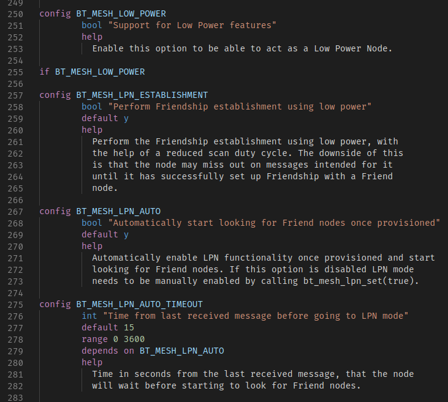
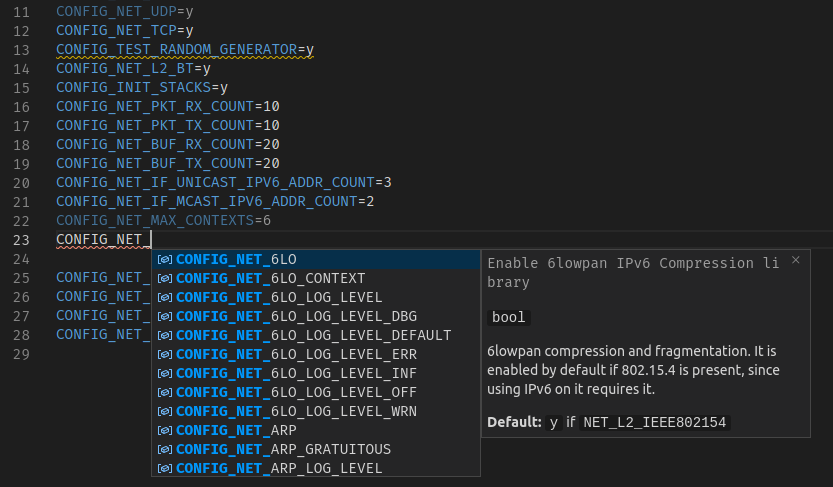

Kconfig language support in vscode.

Made specifically for the
[Zephyr project RTOS](https://www.zephyrproject.org/) to aid application development.

# Features

This extension adds features for Kconfig, properties (.conf) and C files

## Kconfig features



Adds support for the Kconfig language:
- Syntax highlighting
- Autocompletion
- Hover information
- Workspace symbols
- Go to definition
- Follow `source` links
- Resolves environment replacements
- [Breadcrumbs](https://code.visualstudio.com/docs/editor/editingevolved#_breadcrumbs) navigation
- Find all references

## Properties file features



Out of the box, VS Code has syntax highlighting for properties files.

This extension adds contextual information for the properties files:
- Autocompletion based on Kconfig files
- Hover information
- Go to definition
- Syntax checking
- Linting:
  - Typechecking configuration values
  - Range checking
  - Checking for redundant entries
  - Checking for invalid combinations
  - Dependency checking
  - Warning about entries without prompts
- [Code Actions](https://code.visualstudio.com/docs/editor/editingevolved#_code-action)
  - Add missing dependencies
  - Remove redundant entries
  - Use selector entry when trying to set entries without prompts

## C file features

The extension adds symbol information for `CONFIG_` defines in C files.
Hover info and go to definition is provided for all defines starting with `CONFIG_`.

This feature can be turned off with the kconfig.cfiles configuration entry.

# Configuration

Adds five configuration entries:

## kconfig.root

Root of the project's Kconfig files. Will be parsed upon activation.

Default: `./Kconfig`

## kconfig.recursive

Follow `source`, `rsource` and `osource` links in the Kconfig files when parsing.

Default: `true`

## kconfig.env

Environment for inline replacements in the Kconfig files. Each entry will be replaced
in the Kconfig files when encountered as `${entry_name}`. Will also do replacements in
variables in the Kconfig configuration. For instance, an environmental variable may
contain others, like:

```json
"ARCH": "arm",
"BOARD": "nrf52_pca10040",
"BOARD_DIR": "boards/${ARCH}/${BOARD}"
```

Here, `BOARD_DIR` will resolve to `boards/arm/nrf52_pca10040`. The environmental variables
also support VS Code workspace directory replacements: `${workspaceFolder}` and
`${workspaceFolder:zephyr}`, as described in
[the VS Code documentation](https://code.visualstudio.com/docs/editor/variables-reference#_predefined-variables).
Note that other predefined variables from the documentation are not supported.

Default: None

## kconfig.conf

Static configuration entries that are always defined before parsing configuration files.
Should be on the form `"CONFIG_ENTRY_NAME": "y"`. No typechecking or linting is performed
on these variables, but if they're duplicated in the parsed configuration file, a warning
will be produced.

Default: None

## kconfig.conf_files

Like `kconfig.conf`, this entry allows you to add static configuration items, but instead
of defining singular entries, this lists configuration files. The file name may use
environmental completion based on `kconfig.env` and the workspace folder variables, see
[kconfig.env](#kconfig.env).

No typechecking or linting is performed on the variables in these files, but if they're
duplicated in the parsed configuration file, a warning will be produced.

## kconfig.cfiles

Enable or disable Kconfig hover information in C files.

Default: `true`

## kconfig.zephyr.board

A structure defining the board and architecture used in the Zephyr configuration.

Default: `{board: "nrf52_pca10040", arch: "arm"}`

## kconfig.zephyr.west

Path to the `west` tool.

Default: `west`.

# Zephyr setup

Assuming that the Zephyr environment is set up
[with West](https://docs.zephyrproject.org/latest/getting_started/index.html#get-the-source-code),
the extension will just work without any configuration needed.

The entire Kconfig tree (including external modules) is parsed on startup,
and all features will be available as soon as the parsing is complete. This typically takes only 1-2 seconds
after the extension has been activated, and if everything went smoothly, a report will pop up in the
status bar at the bottom of the screen detailing the number of entries found (should be in the range of
5000-10000 depending on configuration and module set) as well as the time spent parsing.

The Zephyr modules (external projects used by Zephyr) are retrieved
with West, in accordance with the [module.yml file specification](https://docs.zephyrproject.org/latest/guides/modules.html#module-inclusion).

The active board is displayed on the left side of the status bar:


To change boards, press the board name on the status bar, or run the "Kconfig: Set board for Zephyr"
command from the command palette (Ctrl+Shift+P). This brings up a quick select menu populated by `west boards`.

The Zephyr configuration can be completely overridden by setting the configuration items described above.

> Note: DeviceTree choice macros, like `$(dt_chosen_reg_addr_hex,$(DT_CHOSEN_Z_CODE_PARTITION))` are not supported, and their configuration values will not be evaluated.
